// Add steps as necessary for accessing the software, post-configuration, and testing. Don’t include full usage instructions for your software, but add links to your product documentation for that information.
//Should any sections not be applicable, remove them

=== CloudFormation nested stack deployment

You can monitor the progress of the stack by choosing **Events** on the top-level stack. Below is a description of each nested stack’s function in the order in which they are deployed.

==== AWSVPCSTACK Nested Stack

If deploying in a new VPC, this is the first nested stack that will appear in the CloudFormation console events view.
This stack creates the VPC, private subnet, public subnet, route tables, NAT gateway, Internet gateway, and a Gateway 
VPC Endpoint for S3.  It also creates public and private subnets in a second Availability Zone for a future DR cluster.  
See the section later in this guide *Adding a DR Cluster*.

==== CloudQStack Nested Stack

All subsequent nested stacks will be contained within the CloudQStack.  If deploying in an existing
VPC this will be the first stack that will appear in the CloudFormation console events view. All nested 
stacks prior to the QSTACK execute in paralllel.  All stacks after the QSTACK execute in parallel.

===== QLOOKUPSTACK Nested Stack

The QLOOKUP Stack is a hierarchical region map that finds the AMI-ID for the marketplace offer 
by region. Note, this stack is not executed when selecting the Specified-AMI-ID option.

===== SECRETSSTACK Nested Stack

The SECRETS Stack stores usernames and passwords in Secrets Manager for the cluster, sidecar, 
and downloading software from Qumulo Trends. The purpose of leveraging Secrets Manager is to 
provide a secure reference for subsequent stacks and users who may forget the passwords assigned.

===== QIAMSTACK Nested Stack

The QIAM Stack creates an IAM profile for the Qumulo Cluster to enable the cluster to manage
EC2 Secondary IP addresses (Floating IPs), decrypt data, send CloudWatch alarms, and send
audit logs to CloudWatch Logs. Note, creating IAM roles with CloudFormation takes some time so don’t be
alarmed if the QIAM stack takes 3 or 4 minutes.

===== QSTACK Nested Stack

The Q Stack spins up all the EC2 instances and EBS volumes for the cluster. It also creates a
placement group for the cluster and tags all the EC2 instances with the appropriate stack
name and node number. In addition, it creates CloudWatch alarms for EC2 instance failure and
a security group for the cluster with the CIDR specified in the template.

===== QADDCIDRSTACK Nested Stack

If additional CIDRs for the Qumulo Security Group were populated, then this nested stack will execute.  
It simply adds the additional CIDRs for ingress traffic respective of all the ports in the security group.

===== MGMTNLBSTACK Nested Stack

If public management of the cluster was chosen in the template this nested stack is executed as 
long as the cluster is NOT being deployed in an AWS Local Zone. It spins up a Network Load Balancer 
with a public Elastic IP. The load balancer listens only on port 443 and optionally on port 3712 if 
the replication port was selected. This load balancer connects to the primary EC2 IP address on each node. 
These are known as the persistent IPs in the Qumulo UI.

===== DNSSTACK Nested Stack

If the Route 53 Private Hosted Zone FQDN was configured then the DNS stack is executed. It
creates the private hosted zone and all the A-records with the name assigned in the template.
All records are given a TTL=0. While round-robin behavior is the goal, Route 53 doesn’t
provide perfect round-robin. Instead the records are given an equal probability of resolution.
Clients are well distributed, but not perfectly symmetric.

===== PROVISIONINGSTACK Nested Stack

This stack spins up an EC2 instance with custom user data. It configures the Qumulo Cluster
and additional AWS environment requirements.  The lists below highlight the major tasks of the
provisioning instance.

====== Qumulo Configuration
* Software upgrades of QSTACK created nodes
* Forms the first quorum for the cluster
* Assigns Floating IP addresses to the cluster
* Configures Sidecar username, password, and custom RBAC role
* Configures Audit Logging for CloudWatch Logs
* Changes the admin password

====== AWS Configuration
* Checks for Public Internet reachability with a CURL test to trends.qumulo.com
* Assigns a QSTACK Policy to protect the cluster in subsequent Stack Updates
* Edits the Customer Managed Key Policy so Sidecar can create CMK encrypted volumes
* Tags EBS volumes with the stack name and volume type
* Tracks software versions, cluster IPs, instance IDs, & UUID in AWS Parameter Store
* Tracks the provisioning instance ‘last-run-status’ in Parameter Store
* Configures Termination Protection for the Stack and the EC2 Instances

This instance automatically shuts down upon completion of its provisioning tasks. **Do not delete this EC2 instance. It will be used for stack updates.**

===== CLOUDWATCHSTACK Nested Stack

This stack creates resource groups, a CloudWatch dashboard, and a CloudWatch log group
(optional) for the cluster. First, it creates a resource group for the EC2 instances and then it
creates one or more resource groups for the EBS volumes. The resource groups created for the
EBS volumes depend on the EBS volume configuration of the cluster. All Flash clusters will
have just one resource group with the stack name and -SSD. Hybrid clusters will have two
resource groups for EBS: one with -SSD and one with -HDD. The purpose of these resource
groups is to provide a simple means to create a filtered view in CloudWatch for the EC2 and
EBS metrics native to AWS.

A CloudWatch Dashboard is also created that presents key metrics sent by the Sidecar Metrics
Lambda function. These are Qumulo specific metrics.
Finally, if Audit Logging was enabled a CloudWatch log group is created for the cluster. All
administrative activity, Lambda access, and file/directory create/modify/delete activity is captured
in this log.

===== QSIDECARSTACK Nested Stack

Assuming the provisioning option was left as YES, the SIDECAR stack is deployed. It creates
two Lambda functions with the specified Sidecar software version. The first is the Metrics
Lambda that sends Qumulo metrics to CloudWatch. The second is the Disk Recovery Lambda
that monitors EBS volumes and automatically replaces any failed EBS volumes. IAM roles,
permissions, and events are created for each Lambda function.

Below is the event view for the top-level stack followed by the event view for the CloudQStack. Note the timestamps to manage expectations on the duration for each nested stack.

[#additional0]
.CloudFormation top-level stack events
image::../images/image0.png[Additional0,width=50%,height=50%]

[#additional1]
.CloudFormation CloudQStack events
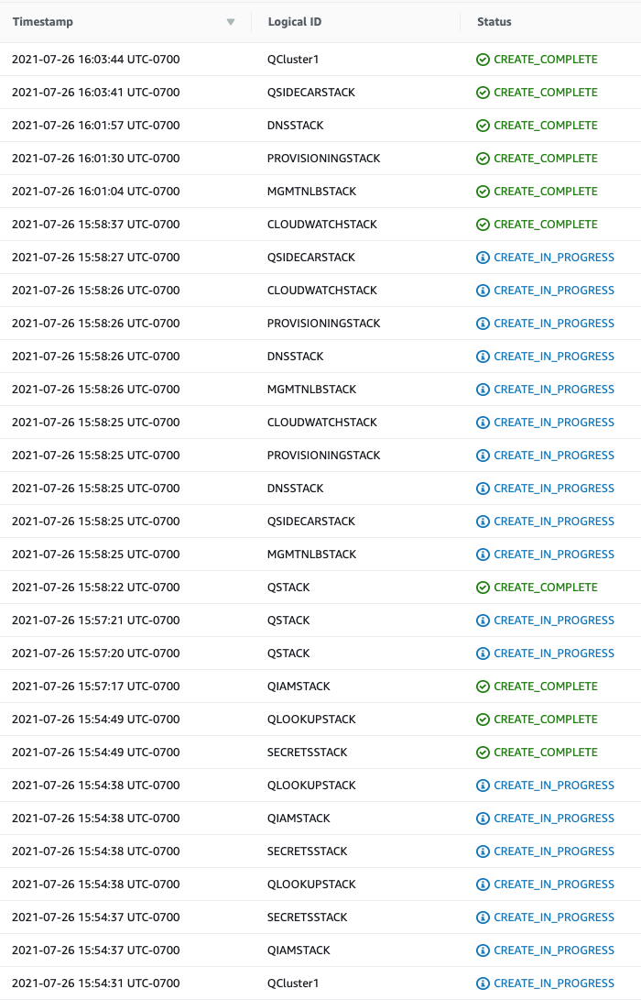

== Post-deployment steps

Once the top-level stack event log shows **CREATE_COMPLETE**, CloudFormation has completed instantiation of all stack resources. Below are the steps to validate the deployment.

=== Review & Verify the AWS Infrastructure

==== Verify the Cluster Instances are Running

In the **AWS EC2 Console** filter on the stack name, clear the running instance filter, and verify
the number of instances for the cluster is as expected. Four in this example.

==== Verify the Provisioning Instance has Stopped

CloudFormation has completed the instantiation of all resources, but this does not mean all
resources are fully initialized and running. Specifically, the Provisioning instance will still be
initializing. Given all the tasks the Provisioning instance has to accomplish it will require at least 
4 minutes AFTER stack completion to finish all tasks. It may require more time if multiple quarterly
software ugprades are executed. When it is finished it will automatically shutdown. If the
provisioning instance has not stopped after 15 minutes, jump to the troubleshooting section.

[#additional2]
.Deployed EC2 instances
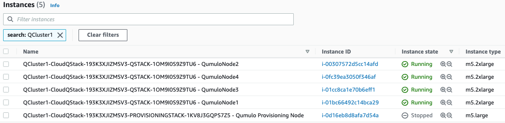

==== Verify the EC2 Security Groups

In the AWS Console go to the **EC2 Security Groups** page and filter on the top-level stack
name. There will be two Security Groups that have been created. Select either to inspect the
ports and CIDRs configured.  Note, a default security group will also have been created if deploying
a new VPC, as is the case in the example below.

[#additional3]
.EC2 security groups
image::../images/image3.png[Additional3]

==== Verify the EC2 Placement Group for the Cluster

In the AWS Console go to **Placement Groups**. A placement group with the stack name has
been created.

[#additional4]
.EC2 placement group
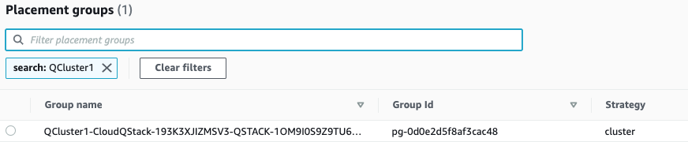

==== Verify the Load Balancer for Public Management (Optional)

In the AWS Console go to **Load Balancers**. If Public Management was selected in the
template a load balancer has been created. It will be listening on 443, and if selected in the
template, 3712 for replication.

[#additional5]
.Load balancer
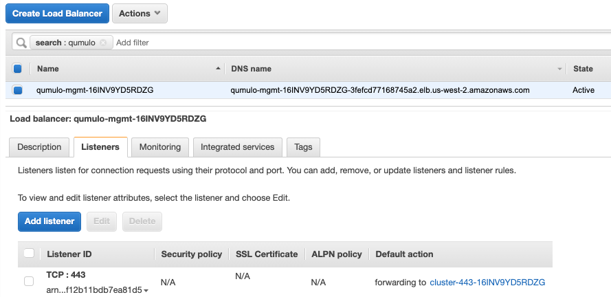

==== Verify EBS Volume Tags

If the Provisioning instance has stopped the EBS volumes will be tagged accordingly for the
cluster and EBS volume configuration. Go to the **AWS Console Elastic Block Store Volumes**
page to verify. The type and number of EBS volumes will vary depending on EBS volume
configuration chosen in the template and the number of EC2 instances.

[#additional6]
.EBS volume tags
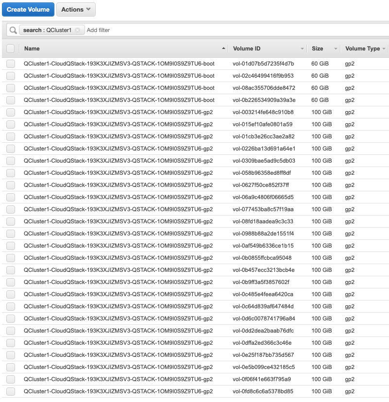

==== Verify EBS Encryption with a CMK (Optional)

On the same page scroll to the right to verify that the volumes are encrypted with the
Customer Managed Key assigned in the template. This is only relevant if a CMK was specified.
If the field was left blank in the template, AWS will generate a key to encrypt the data at rest.

[#additional7]
.EBS encryption
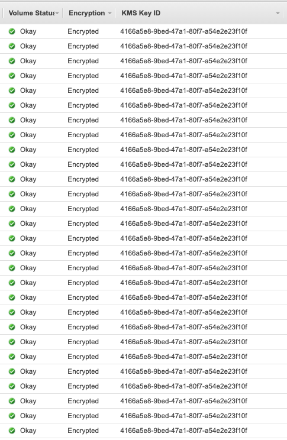

==== Verify the KMS CMK Policy (Optional)

In the AWS Console go to the **Key Management Service** page and select the CMK that was
chosen in the template. Verify that the policy has been updated with two SIDs, one for the
Metrics Lambda and one for the Disk Recovery Lambda. If the policy is not updated it is likely
the Provisioning node will not have shutdown because the policy was not cleaned up prior to
launching the template. Without this policy modification in place the Sidecar will not be able
to create a new EBS volume to replace a failed EBS volume.

[#additional8]
.KMS key policy
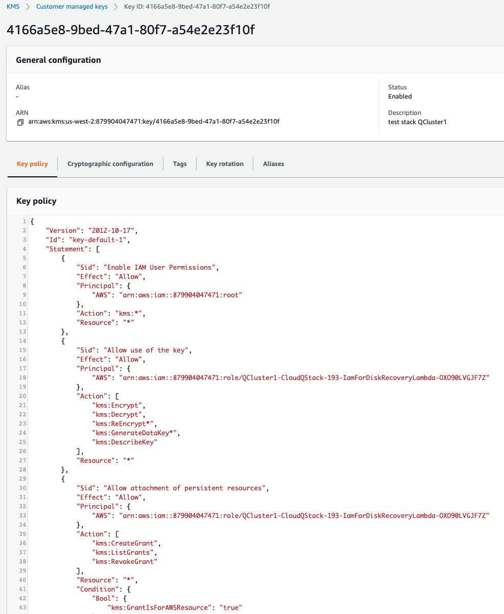

==== Verify Secrets Manager Secrets

In the AWS Console go to the **Secrets Manager** page and filter on the top-level stack name.
There will be three secrets that have been created to store username/password pairs. Select
any of them to see the credentials.

[#additional9]
.Secrets Manager secrets
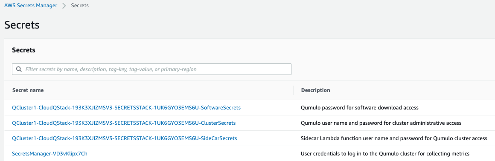

==== Verify the IAM Roles

In the AWS Console go to the **IAM** page and filter on the top-level stack name. There will be
four IAM roles that have been created: two for the Sidecar, one for the cluster, and one for the
provisioning instance.

[#additional10]
.IAM Roles
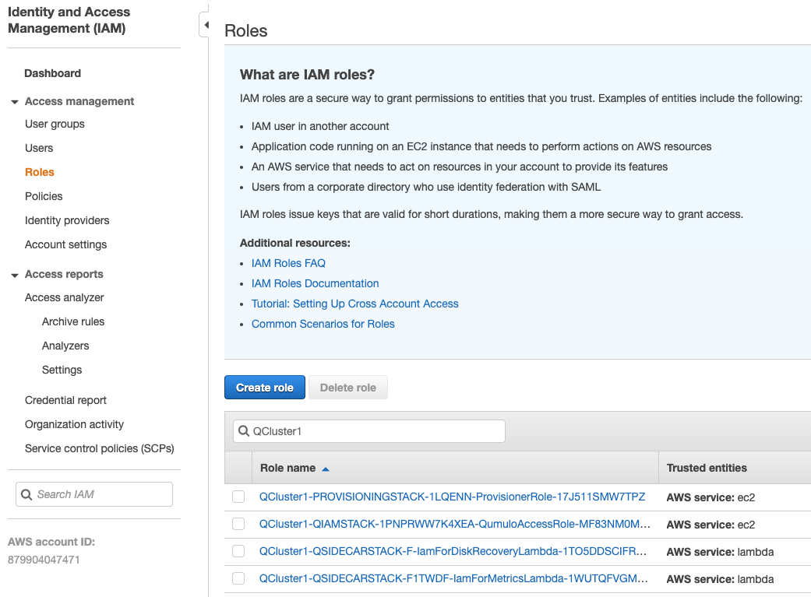

==== Verify Sidecar Lambdas

In the AWS Console go to the **Lambda** page and filter on the top-level stack name. There will
be two Lambda functions. Select the **Disk Recovery Lambda** and then choose **Monitor**. In the
populated graphs check that the Error Count and Success Rate shows 100% green and 0%
red. This confirms the Disk Recovery Lambda is communicating with the cluster. Review the
Metrics Lambda in the same manner.

[#additional11]
.Sidecar Lambdas
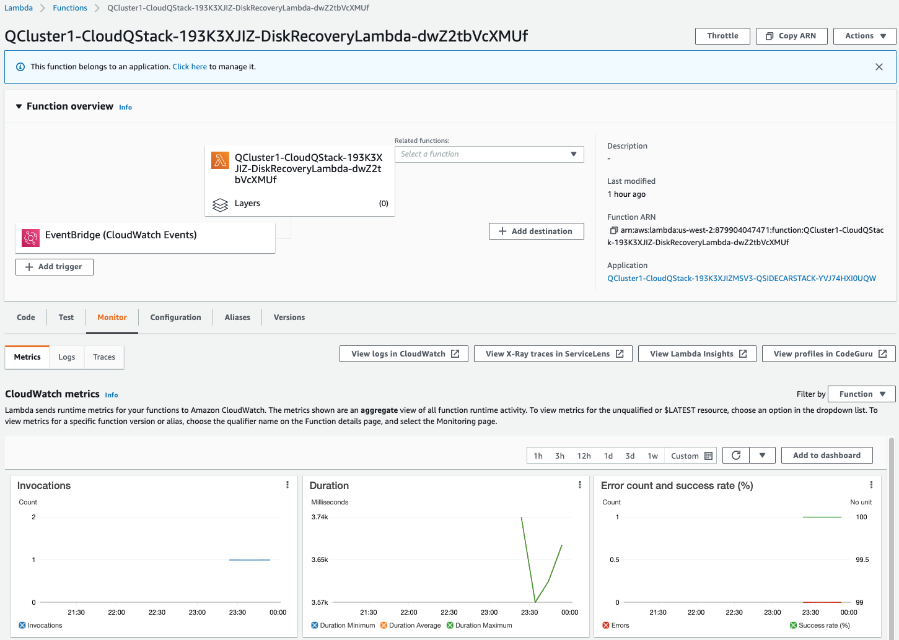

==== Verify Route 53 Private Hosted Zone for DNS (Optional)

In the AWS Console go to **Route 53**. Select the Private Hosted Zone that was created; in this
example it is **qcluster1.local**. Verify the A-records were created with the A-record name specified in the
template. This is only relevant if an FQDN was specified, otherwise Route 53 configuration is
skipped. Note, 16 A-records were created, one for each floating IP, since 4 EC2 instances with
4 floating IPs were chosen in the template.

[#additional12]
.Route53 private zone
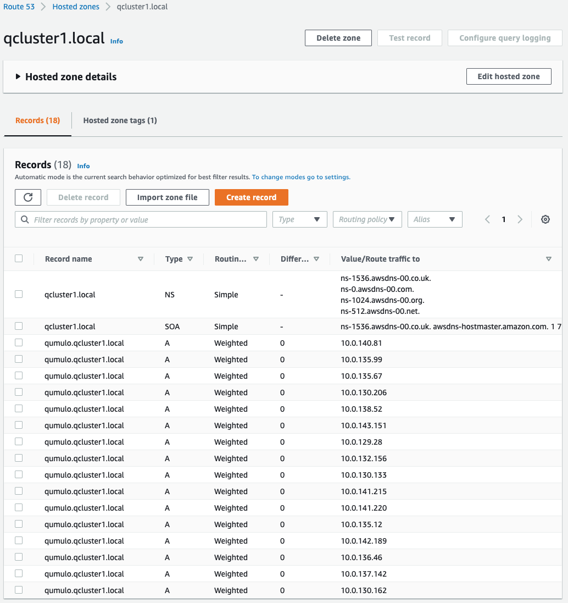

==== Verify Resource Groups

In the AWS Console go to **CloudWatch**. Choose **Service Dashboards** then choose **EC2**.  In the first filter box choose **EC2** and then in the **Filter by resource group** box select the cluster with **Qumulo-Cluster-EC2-[Stack Name]**. This provides a CloudWatch filtered view of the EC2 instances for the cluster. CPU Utilization,
network stats, boot volume stats, and alarm events are available.

[#additional13]
.CloudWatch metrics
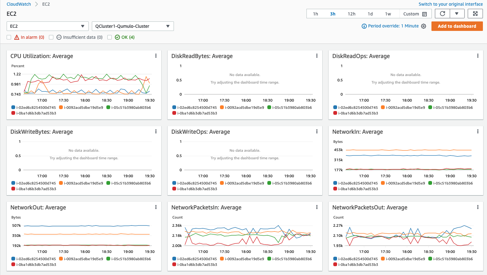

Now clear the **Filter by resource group** field and select **EBS** in the first filter box. Now in the
**Filter by resource group** field choose the cluster with **Qumulo-Cluster-[SSD or HDD]-[Stack Name]**. This is a CloudWatch view of the EBS volumes for the cluster. Note, boot volumes are not included in this view.

[#additional14]
.CloudWatch metrics filtered
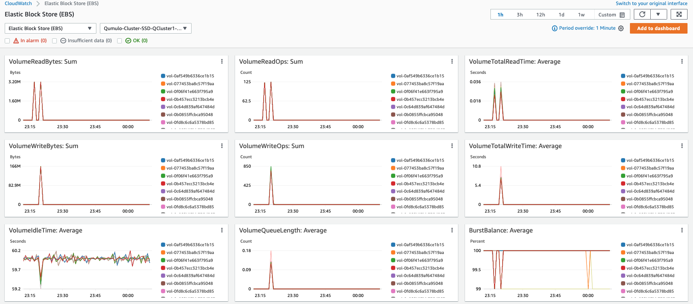

==== Verify CloudWatch Dashboard

In the AWS Console go to **CloudWatch > Dashboard > Qumulo-Cluster-[Stack Name]-QSTACK-[123456789ABCD]**. This is a dashboard that has been built to display the metrics sent by the Qumulo Sidecar Metrics Lambda function. Instance health, EBS health, Available Capacity, and Performance data are all available. This dashboard is very useful for historical data that is over 72 hours old. For real-time data visit the Qumulo cluster’s UI. Note: If you are deploying multiple clusters in an AWS region give them unique Qumulo Cluster Names. Metrics are filtered based on the Qumulo Cluster Name.

[#additional15]
.CloudWatch dashboard
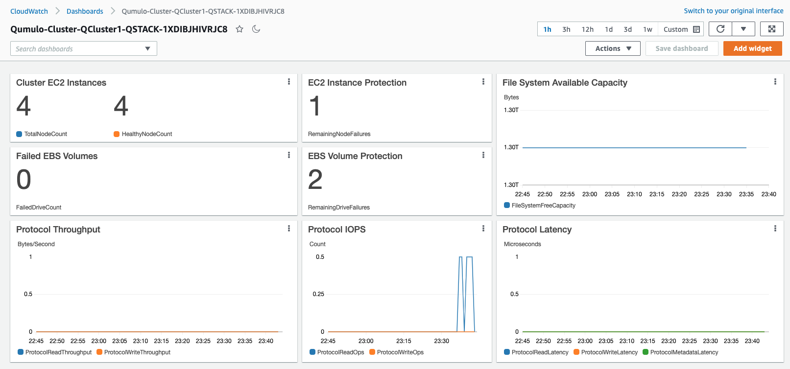

==== Verify CloudWatch Logs (Audit Logging)

In the AWS Console go to **CloudWatch > Log Groups > /qumulo/[Stack Name]**. This log
group is configured if Audit Logging was enabled in the CloudFormation template. Log files
will immediately be available for each instance in the cluster.

[#additional16]
.CloudWatch log groups
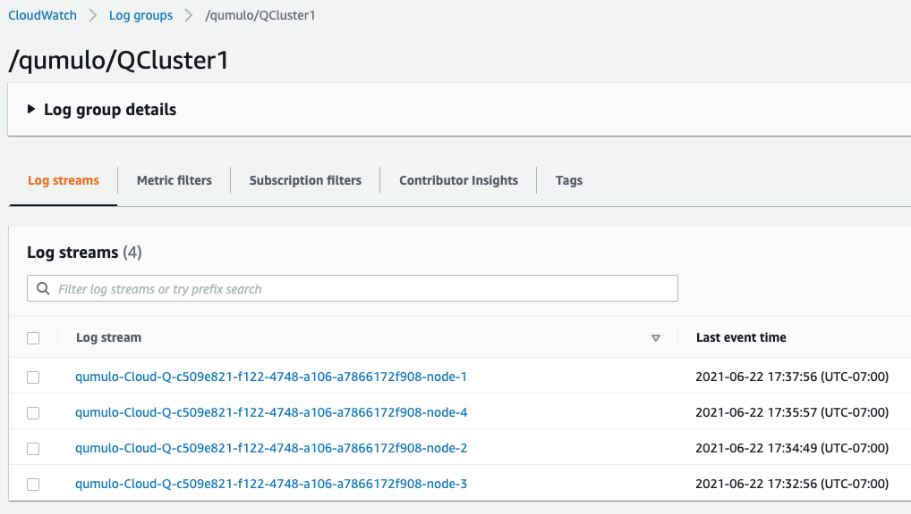

=== Review & Verify the Qumulo Cluster Configuration

==== Review the Outputs of the CloudFormation Stack

Go to the **CloudFormation** page and select the top-level stack name. Choose
**Outputs**. If Route 53 was configured a URL to the private addresses, resolved by Route 53,
will be shown. If Route 53 was skipped, a URL to the first node’s primary IP address will be
displayed. Likewise, if Public Management was chosen a URL to the Elastic IP (public static)
address will be shown. If connecting via the public Internet, open a page from your local
machine using the **QumuloPublicIP** URL. If connecting from within your VPC, paste the
**QumuloPrivateIP** URL into the browser of an EC2 instance running Chrome.

[#additional17]
.CloudFormation outputs
image::../images/image17.png[Additional17]

==== Verify Admin Password

The login page should authenticate with the credentials:
Username: **admin**
Password: **‘your chosen Admin password’**
If you’ve forgotten the admin password entered in the template go to Secrets Manager and
retrieve it.  If this login screen doesn't appear the cluster has not formed Quorum. Do 
not form quorum manually because the provisioning instance will not be able to complete all
secondary provisioning.  Instead, go to troubleshooting *The Cluster Didn't Form Quorum*.

[#additional18]
.Qumulo login
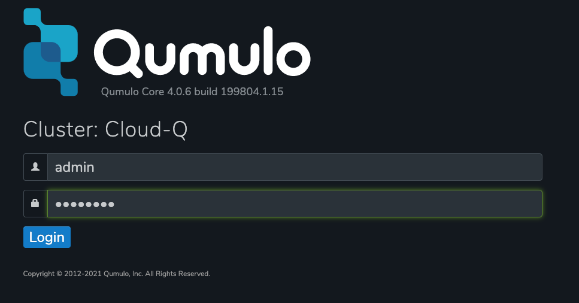

==== Verify Quorum and Protection

After logging in, the cluster dashboard should be displayed. IF it isn’t the cluster failed to form
quorum. Jump to troubleshooting.

[#additional19]
.Qumulo dashboard
image::../images/image19.png[Additional19]

Choose **More details**. The number of nodes in the cluster should match what was provisioned
in the template. Further, to the right is the protection status showing protection for 1 node
failure or 2 disk failures.

[#additional20]
.Qumulo dashboard details
image::../images/image20.png[Additional20]

==== Verify Software Version

In the top right of the Qumulo UI the software version is displayed. This should match the
software version requested when the template was filled in. Here it shows Qumulo Core
version 4.2.0 as expected.

[#additional21]
.Qumulo software version
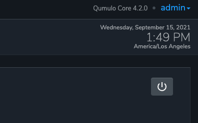

==== Verify Floating IPs

Go to the **Cluster** tab and select **Network Configuration**. Each node will have a persistent IP.
This is the EC2 primary IP address that is provided via DHCP at creation and subsequently
never changes unless the instance is destroyed (i.e. terminated). Also, each node will have
floating IPs associated with it. In this case 4 floating IPs per instance were chosen.
These IPs are EC2 secondary IPs that the cluster now manages as floating IPs. The AWS EC2
console will only display what EC2 secondary IPs were assigned to an instance at creation. For
real-time status always refer to the Qumulo UI.

[#additional22]
.Qumulo floating IP addresses
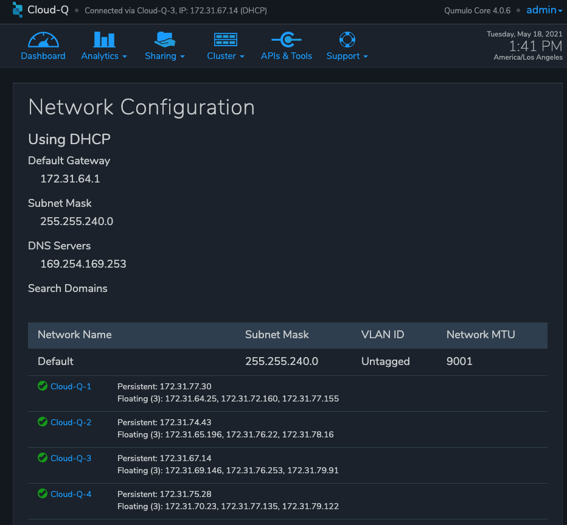

==== Verify Sidecar User and Custom RBAC Configuration

Previously the Sidecar Lambda function connectivity to the cluster was verified. There’s no
need to review the Sidecar User and RBAC configuration. If you desire to review these they are
under **Cluster** -> **Local Users & Groups** and **Cluster** -> **Role Management**, respectively.

=== Stack Update Options

Note: Make sure *Roll back all stack resources* is enabled within CloudFormation when performing stack updates.  This 
is required when a resource must be replaced.  

==== Supported Stack Update Parameters for Existing VPC with Standard parameters template

If you deployed with the *Deploy Cloud-Q in an existing VPC with Standard parameters* template a
limited set of stack updates are supported.  If you want access to all potential stack updates
you will need to perform a stack update to convert to the advanced template.  See the section
*Updating to the Advanced Template*.  The table below lists the stack update options for the standard
template.

|===
||Add |Del |Change

// space for headers
|Total Number of Qumulo EC2 Instances | | |increase
|Qumulo Sidecar Software Version | | |✓
|Termination Protection |✓ |✓ |✓
|===

==== Supported Stack Update Parameters for New VPC and Existing VPC with Advanced parameters templates

Both the New VPC and existing VPC with Advanced parameters templates support the list of stack update
options below.

|===
||Add |Del |Change

// space for headers
|Total Number of Qumulo EC2 Instances | | |increase
|Floating IPs for IP Failover | | |✓
|Provision Qumulo SideCar Lambdas |✓ | |
|Qumulo Sidecar Software Version | | |✓
|Qumulo Security Group CIDRs #2, #3, #4 |✓ |✓ |
|Termination Protection |✓ |✓ |✓
|OPTIONAL: SNS Topics for automated Instance Recovery & EBS Volume Recovery |✓ |✓ |✓
|OPTIONAL: Provision Public IP for Qumulo Management |✓ |✓ |✓
|OPTIONAL: Replication Port for Qumulo Public IP |✓ |✓ |✓
|OPTIONAL: FQDN for R53 Private Hosted Zone |✓ |✓ |✓
|OPTIONAL: R53 Record Name for Qumulo RR DNS |✓ |✓ |✓
|OPTIONAL: Send Qumulo Audit Log messages to CloudWatch Logs? |✓ |✓ |✓
|===

==== Adding Node(s) to the Cluster

A Qumulo cluster may be grown in both capacity and performance by adding additional nodes
(EC2 instances) to the cluster. This stack supports adding as many as 16 nodes in one stack
update for a maximum of 20 nodes total in the cluster. Each node added increases compute,
networking, and storage capacity. To add nodes to a cluster follow the procedure below. Note,
total instance count may only be increased, not decreased. If total instance count is decreased
the stack update will fail and rollback.

**IF you have upgraded the software on the cluster after initial deployment leave the software version for the cluster in the template as it was originally provisioned. The stack is unaware of this update and the software version field for the cluster can not be used for upgrades after initial deployment.**

1. Go to the **CloudFormation** view in the AWS Console
2. Select the top-level stack name
3. Select **Update** in the upper right corner
4. Keep the default **Use Current Template**
5. Select **Next**
6. The template as last populated will be displayed
7. Scroll down to the **Total Number of Qumulo EC2 Instances**
8. Increase the number of instances to the chosen value, **8** in this example
9. Select **Next**
10. Select *Roll back all stack resources*
11. Select **Next** again
12. **Check both boxes** acknowledging that CloudFormation may create IAM roles and that it may leverage CAPABILITY_AUTO_EXPAND.
13. Select **Update stack**

The stack will commence updating. In this case four nodes will be added to the cluster. This is
not service impacting as the existing nodes are left untouched. There is a brief quorum bounce
to add the four new nodes to the cluster. Below is a view of the AWS EC2 Console showing
the new instances initializing.

[#additional23]
.EC2 instances
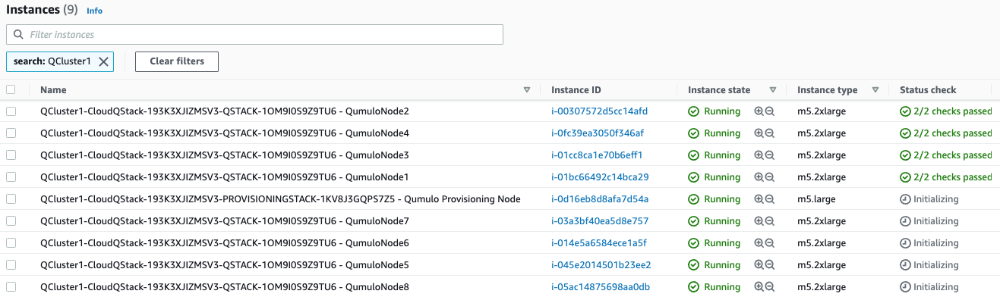

Notice that the Provisioning instance is also being restarted. This is by design. The Provisioner
will query the latest version of software running on the cluster and upgrade all new nodes to
this version of software before joining them to the cluster. Further, it tags all the new EBS
volumes and updates the floating IPs.

This stack provisioned Public Management and Route 53 originally. With the addition of new
nodes, IP addresses need to be added to the Load Balancer and the Route 53 Private Hosted
Zone. The stack will automate these updates as well. You may review any nested stack to see
what resources were modified or added in the stack **Events** tab. At the completion of node
addition you may review any and all of the AWS infrastructure referencing the former section.
As a final check make sure the Provisioning node shutdown which indicates success of all
secondary provisioning.

[#additional24]
.EC2 instances
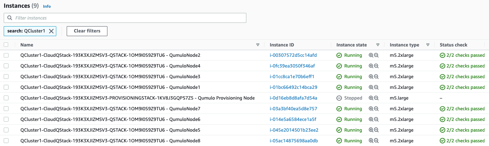

Finally, login to the cluster and verify the node addition.

[#additional25]
.Qumulo cluster nodes
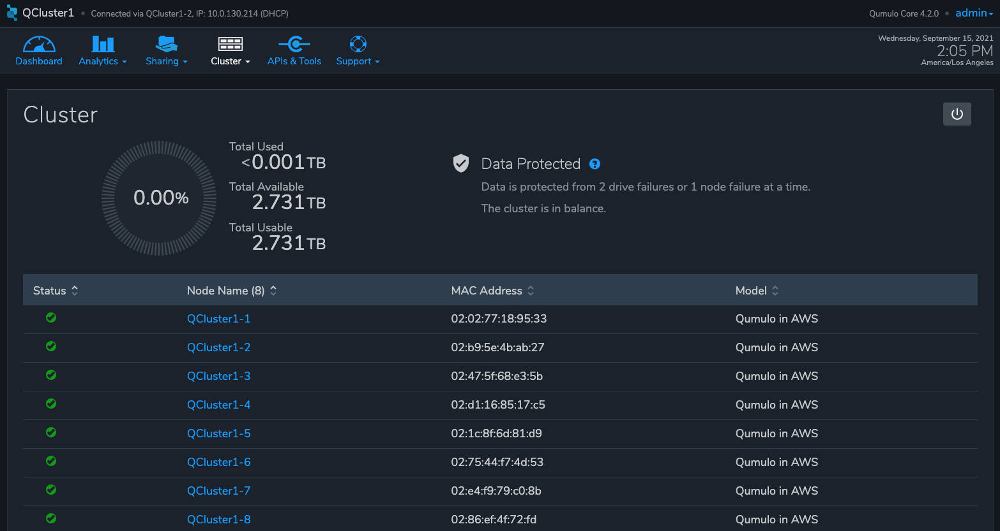

==== Changing the number of Floating IPs

A stack update may be used to change the number of floating IPs per EC2 instance. Follow the same steps as a Node Addition, but change the Floating IP for IP Failover field to the desired number of floating IPs per instance, 1-4, instead of changing the number of EC2 instances (steps 7 & 8 above). Note, if DNS for the floating IPs is being managed outside of the stack, the UNC path for clients mounting the cluster will be impacted until DNS is manually updated. To avoid this use the R53 Private Hosted Zone feature of this template.

==== Updating the Sidecar Software Version

A stack update may be used to update the Sidecar software version. Follow the same steps as
a Node Addition, but change the **Sidecar Software Version** field to the desired version instead
of changing the number of EC2 instances (steps 7 & 8 above). This is typically done after
updating the cluster software via the Qumulo UI.

==== Adding or Removing Qumulo Security Group CIDRs #2, #3, #4

A stack updated may be used to provision additional CIDRs for the Qumulo security group. If 
a CIDR change is desired remove the CIDR by leaving the field blank and executing the stack
update.  Then run the stack update again for the new CIDR.  For every CIDR added, all ports in the 
security group are provisioned with ingress rules.  Services allowed are SSH, HTTPS, HTTP, SMB,
NFS, FTP, REST, and Qumulo Replication.

==== Adding or Removing Public Management

A stack update may be used to add or remove public management. Since this update is completely separate from the cluster there’s no changes required to the cluster infrastructure or infrastructure touched by the Provisioning instance. Hence, it will not restart. Follow the same steps as a Node Addition, but change the **OPTIONAL: Provision Public IP for Qumulo Management** parameter to ‘YES/NO’ instead of changing the number of EC2 instances (steps 7 & 8 above). Note, the MGMTNLBSTACK will be deleted when removing public management. This is expected. The stack will show as DELETE_FAILED for a period of time while CloudFormation retries the delete of the Elastic IP. Ultimately it will succeed.

==== Adding or Removing Route53 DNS Private Hosted Zone

It is possible to change the R53 FQDN, but AWS requires the deletion of the current Private
Hosted Zone and a new one will be rebuilt if the FQDN is modified in a stack update. To
remove the private hosted zone, clear the FQDN parameter. In the stack update pages
you can review the changes the update will make. Follow the same steps as a Node Addition,
but change the **OPTIONAL: FQDN for R53 Private Hosted Zone** parameter to the desired
value instead of changing the number of EC2 instances (steps 7 & 8 above).

==== Enabling or Disabling Audit Logging

A stack update may be used to enable or disable Qumulo audit logging. These logs are stored
in a CloudWatch Logs log group. If a stack update is used to disable audit logging the log
group will be deleted. Likewise, if audit logging is enabled in a stack update a log group will
be created with the name **/qumulo/[Stack Name]**. Follow the same steps as a Node Addition,
but change the **OPTIONAL: Send Qumulo Audit Log messages to CloudWatch Logs?**
parameter to ‘YES/NO’ instead of changing the number of EC2 instances (steps 7 & 8 above).

==== Adding the Qumulo Sidecar Lambdas

If the Sidecar was not deployed with the Cluster originally, it may be added subsequently to the stack. Follow the same steps as a Node Addition, but change the **Provision Qumulo Sidecar Lambdas** parameter to ‘Yes’ instead of changing the number of EC2 instances (steps 7 & 8 above). Removing the Sidecar lambdas is not supported.

==== Enabling or Disabling Termination Protection

A stack update may be used to enable or disable Termination Protection for the EC2 instances and the CloudFormation stack. Termination protection should be enabled in all production environments. Only disable it with a stack update prior to deleting the stack.

==== Adding or Removing SNS Topics for recovery alarms

A stack update mya be used to add SNS topic ARNs for the EC2 Instance Recovery alarm and the
EBS Volume Recovery alarm.  These notification ARNs can be added, removed, or changed with a 
stack update.

==== Other Stack Updates and the QSTACK Policy

The only restrictions placed on stack updates are for the Qumulo cluster. Specifically this is
the QSTACK. The stack policy is applied by the Provisioning instance, and it forbids any
modifications, deletions, or replacements of QSTACK EC2 and EBS infrastructure. This is to
protect production environments from erroneous stack updates. In the event a stack update is
attempted for an unsupported change the update will simply fail and rollback without harm.
Many stack updates are possible and not all permutations have been tested. The common
examples are documented above that are most productive and well tested.

==== Changing EC2 Instance Types and EBS Volume Types

Qumulo does not support changing the cluster instance types with a stack update. This is
prevented with the aforementioned stack policy. While it would be possible if allowed, it
would stop all the instances, change the instance type, and restart them. This would be
service impacting in a production environment. Instead Qumulo recommends shutting down
an instance at a time so the cluster can leverage floating IPs and maintain the production
workload.

Due to the permutations of EBS volume configurations the likelihood of user error is high
attempting to change EBS volume types with a stack update. Rather than risk data loss this is
blocked by the QSTACK policy.

For both EC2 instance type changes and EBS volume type changes Qumulo offers simple scripts
that are production friendly.

=== Updating to the Advanced Template

If you deployed in an existing VPC with the standard parameters template you can convert
to the advanced template to gain access to all of the stack update options.  The conversion process
consists of doing a stack update and replacing the template as follows:

1. Click on the **Deploy Cloud-Q in an existing VPC with Advanced parameters on AWS** link in the **Launch the Quick Start** section
2. Copy the auto-populated **Amazon S3 URL** for the template
3. Close this window
4. Go to the **CloudFormation** view in the AWS Console
5. Select the top-level stack name from the previous deployment that used the standard parameters template
6. Select **Update** in the upper right corner
7. Choose **Replace current template**
8. Paste the copied S3 URL into the **Amazon S3 URL** field
9. Select **Next**
10. The advanced template is now displayed with the previous standard parameters and advanced default parameterss
11. Leave all parameters as populated with the exception of the **Qumulo Sidecar Lambdas Private Subnet ID** and **AWS Public Subnet ID**
12. You may use the **AWS Private Subnet ID** or any other subnet ID in the VPC in both of these fields.  This is just to satisfy the template parser, nothing is being changed in the deployment.
13. Select **Next**
14. Select **Next** again
15. **Check both boxes** acknowledging that CloudFormation may create IAM roles and that it may leverage CAPABILITY_AUTO_EXPAND.
16. Select **Update stack**
17. When the stack status is displayed as **UPDATE_COMPLETE** the advanced template is now in use and operation
18. Execute another CloudFormation stack update per the **Stack Update Options** section to modify and maintain the deployment

=== Termination Protection

In production deployments it is wise to enable Termination Protection for the entire stack and the EC2 instances. The template provides this protection by default.

=== Deleting the Stack

When a cluster is no longer needed ensure all critical data has been removed from the cluster.
Qumulo’s SHIFT functionality may be used to natively copy data from the cluster to S3.
Alternatively, Qumulo supports S3 Snapshots but rehydration will require a cluster with the
same EBS volume configuration. Once the data has been archived with the chosen method then use CloudFormation to update the stack to **Disable Termination Protection**.
Finally, select the **top-level stack** in CloudFormation and choose **Delete**. All resources will be
deleted.

If a Customer Managed Key was used for encryption at rest, the KMS CMK policy must be
cleaned up. It’s simplest to do this after the stack is completely deleted. AWS CloudFormation
does not support CMK policy modifications so it is unable to track these changes that the
Provisioning instance applied. Go to the **AWS Key Management Service** and select the **CMK**
that was used. Then **Edit** the policy. **Delete** the two SIDs for the Sidecar and select **Save**. If
the key policy had no other SIDs applied to it, aside from the Qumulo Sidecar SIDs, it will have
the following JSON structure before and after being cleaned up.

[#additional26]
.KMS key policy before cleanup
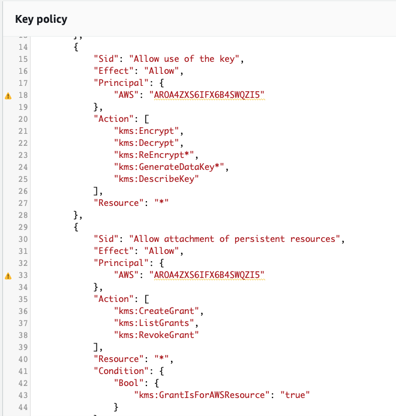

[#additional27]
.KMS key policy after cleanup
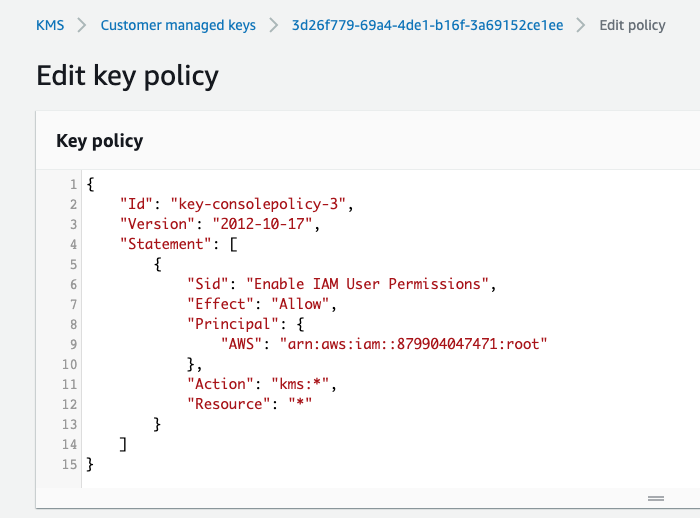

As of the date of this document AWS CloudFormation will fail to delete all of the
MGMTNLB stack resources (If Public Management was provisioned). Simply let the
deletion finish, reselect the MGMTNLB stack and delete it again, and then delete the
top-level stack.

=== Qumulo SHIFT for Amazon S3

Qumulo Core supports copying data to and from Amazon S3.  After the cluster is up and running you may populate data on it by
copying data from a chosen S3 bucket.  To create a SHIFT job, login to the Qumulo UI and select *Cluster* > *Copy to/from S3* and fill in the parameters.  
For detailed documentation on the Qumulo SHIFT feature set, UI, and CLI please refer to the following Qumulo documents:

* https://github.com/Qumulo/docs/blob/gh-pages/shift-from-s3.md[Qumulo SHIFT - Copy from S3^]
* https://care.qumulo.com/hc/en-us/articles/360053162273-Qumulo-Shift-for-Amazon-S3[Qumulo SHIFT - Copy to S3^]

=== Multi-AZ with Qumulo DR

For disaster recovery and business continuity one or more clusters may be deployed in other Availability Zones or other Regions.
The process to deploy in another Region is identical to the deployment addressed in this deployment guide.  Similarly, multi-AZ
functionality may be leveraged by deploying a cluster in a second AZ within the chosen region.  The following steps demonstrate
how to deploy a DR cluster assuming the production cluster was deployed in a new VPC.

==== Deploy the DR Cluster

Launch another quick start selecting the *Deploy {partner-product-short-name} into an exisiting VPC with Advanced parameters*.  Fill in the stack parameters
to deploy the cluster in the VPC created with the QCluster1 CloudFormation stack and name this second stack, and the cluster, QCluster1-DR.
However, choose the public and private subnet IDs associated with the *DR* subnets.  These will be apparent in the drop downs within the template.  
By choosing the DR subnets the cluster will be placed in the second availability zone built by the QCluster1 stack.
In this example a Qumulo Hybrid sc1 cluster with 20TB of usable capacity is built with four EC2 instances and a mix of gp2 and sc1 EBS volume types.
This is an example where the DR cluster may be sized and configured with completely different paramaters from the production cluster.  
Numerous reasons exist for this flexibility from cost savings to capacity planning, persisting
snapshots for long periods of time, and curating file data before archival to S3.  For these reasons, and many more, the addition of a DR cluster
is not automated when deploying the production cluster, but rather, handled as a subsequent deployment to provide the flexibility of location, size,
and capability.

[#additional28]
.QCluster1-DR Dashboard
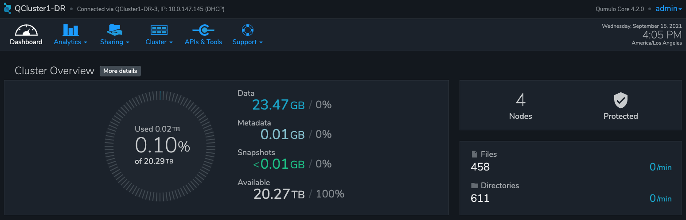

==== Configure Replication on the Source Qumulo cluster

With Qumulo Core's native replication, data may be copied from the production cluster to the DR cluster in a continuous fashion.
This replication is asynchronous and resilient to any networking connectivity issues.  Whether you are replicating to a cluster in the
same VPC or a cluster in another region, the replication job will not loose data due to networking issues.  In this example continuous replication 
will be enabled on the root directory of the source cluster to the root directory of the target cluster.  However, replication is 
configurable per directory, making it easy to select what data you want to replicate to the DR cluster.  First, click on *Cluster*, then choose
*Replication*, then *Create Relationship*.  The figure below shows the configuration of the replication relationship on the production source cluster, 
*QCluster1*, targetting the DR cluster *QCluster1-DR*.  Note, a floating IP for the target cluster was used for the target IP address.
Finally, select *Save Relationship*

[#additional29]
.QCluster1 Replication Relationship Configuration
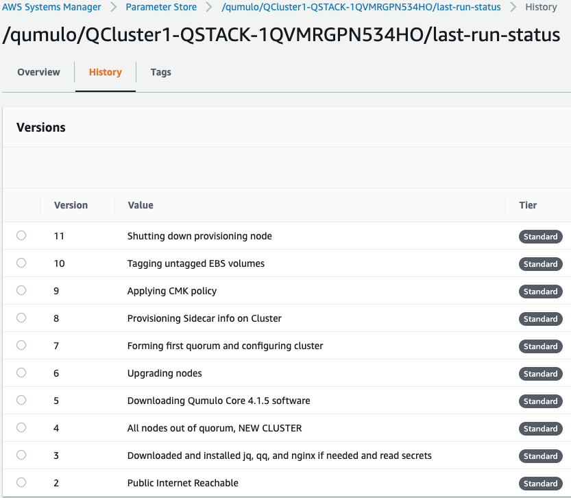

Now the source cluster is waiting for the relationship to be accepted on the destination cluster QCluster1-DR.

[#additional30]
.QCluster1 Replication Relationship Waiting for Destination Acceptance
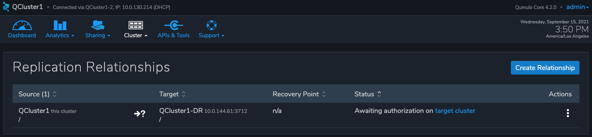

==== Accept the Replication request on the Target Qumulo cluster

QCluster1-DR will pop up a message alerting you to the fact that a new replication relationship has been requested.  Click on *See Details*.

[#additional31]
.QCluster1-DR Notification of Replication Relationship Authorization Request
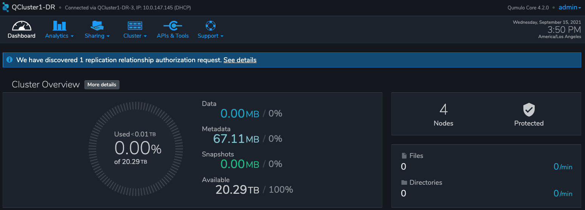

Now accept the replication request by selecting *Authorize* on QCluster1-DR which is the target for the replication as shown below.

[#additional32]
.QCluster1-DR Replication Relationship Authorization
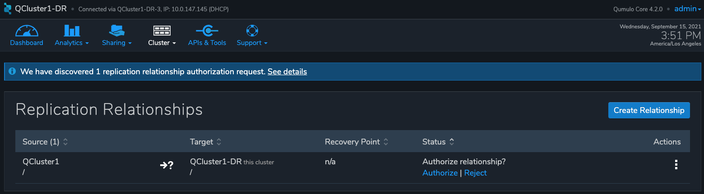

==== Monitor the status of the Replication Relationship on the Source Qumulo cluster

At any time the status of the replication relationship is shown on the source cluster, QCluster1 in this example.  Replication
may be paused or terminated, as well.  Replication performance is based on a combination of cluster workload, network bandwidth,
 and network latency.  Replication between Availability Zones in the same VPC will be faster than replication between regions due to the latency 
 of the network connectivity.  Replication performance can be increased by creating multiple replication jobs for multiple directories rather
 than just replicating the root directory.  Below are two screen shots showing the replication job in progress and complete.

[#additional33]
.QCluster1 Replication In-Progress
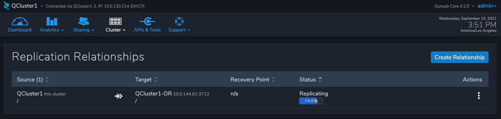

[#additional34]
.QCluster1 Replication Complete
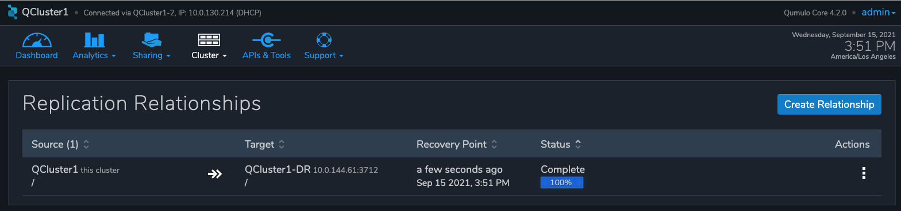
