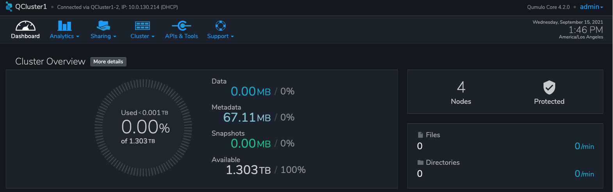
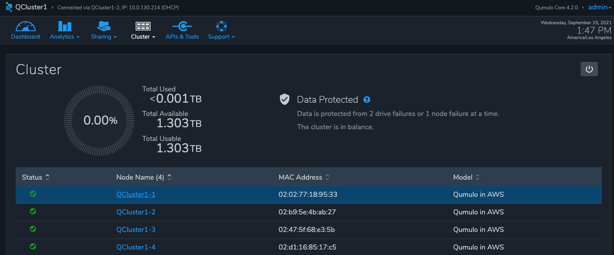

== Test the deployment

=== Check the EC2 instances

Follow these steps to confirm that all the cluster instances are running and that the provisioner instance has stopped running.

. Open the https://console.aws.amazon.com/ec2/v2/[EC2 console^].
. Choose the stack name.
. Clear the *Instance state = running* filter.
. Verify that all the cluster instances are running.
. Verify that the provisioner instance (`...Qumulo Provisioning Node`) has stopped running. If it's still running, wait. It takes up to 15 minutes after stack creation for this instance to finish initializing. If it hasn't stopped running after 15 minutes, see the troubleshooting section link:#_the_provisioner_instance_is_still_running[The provisioner instance is still running].

=== Check cluster quorum formation and data protection
Follow these steps to confirm that the cluster formed quorum, that you have the expected number of instances in the cluster, and that your data is protected.

. Open the https://console.aws.amazon.com/cloudformation/[CloudFormation console^].
. Choose the top-level stack name. 
. Choose *Outputs*. A list of URLs appears.
. Copy the appropriate URL from the *Value* column, and paste it into your browser as follows: 
+
* If connecting by the public internet, copy the *QumuloPublicIP* URL, and open a page from your local machine. 
* If connecting from within your VPC, copy the *QumuloPrivateIP* URL, and paste it into the browser of an EC2 instance running Chrome.

. Log in to the Qumulo user interface with the user name 'admin' and administrator password you provided during deployment. When you see the Qumulo dashboard, shown in <<additional19>>, you know that your cluster formed quorum. 
+
[#additional19]
.Qumulo dashboard

+
If, instead of being prompted for a user name and password, you see the End User Agreement screen, the cluster failed to form quorum. See the troubleshooting section link:#_the_cluster_didnt_form_quorum[The cluster didn't form quorum].

. Choose *More details*. Verify the following, as shown in <<additional20>>.
.. The number of instances (nodes) listed matches the number you expect.
.. Each instance has a green checkmark in the *Status* column.
.. This message appears: "Data is protected from 2 drive failures or 1 node failure at a time. The cluster is in balance."
+
[#additional20]
.Qumulo dashboard details

== Postdeployment steps

=== (Optional) Set up disaster recovery - Qumulo Recover Q

For disaster recovery and business continuity, you can deploy one or more https://qumulo.com/solution/recover-q/[Qumulo Recover Q^] clusters in other Availability Zones or AWS Regions. For more information, see https://github.com/qumulo/aws-quickstart-cloud-q/blob/main/supplemental-docs/deploy-recover-q.pdf[Cloud Q Quick Start: Deploy a Recover Q Cluster^].

=== (Optional) Copy data into your cluster from an S3 bucket

If you're using Qumulo Core version 4.3.0 or newer, you can populate data on your Qumulo cluster by copying data from an Amazon S3 bucket using https://qumulo.com/wp-content/uploads/2020/06/ShiftForAWS_DataSheet.pdf[Qumulo Shift for Amazon S3^]. To create a Shift job, follow these steps:

. Log in to the Qumulo UI.
. Choose *Cluster*, *Copy to/from S3*.
. Fill in the parameters. 

For more information on the Qumulo Shift feature set, user interface, and command-line interface, see the following:

* https://github.com/Qumulo/docs/blob/gh-pages/shift-from-s3.md[Qumulo Shift—Copy from S3^]
* https://github.com/Qumulo/docs/blob/gh-pages/shift-to-s3.md[Qumulo Shift—Copy to S3^]

=== Additional information
To learn how to use the stack to maintain the Qumulo cluster through its life cycle and view metrics in CloudWatch, see the following:

[cols="1,2"]
|===
|Documentation |Description

// Space needed to maintain table headers
|https://github.com/qumulo/aws-quickstart-cloud-q/blob/main/supplemental-docs/stack-updates.pdf[Cloud Q Quick Start: Supported CloudFormation Stack Updates^]| Details on CloudFormation stack update options and examples, including adding instances (nodes) to the cluster and upgrading the Qumulo Sidecar.
|https://github.com/qumulo/aws-quickstart-cloud-q/blob/main/supplemental-docs/stack-deletion.pdf[Cloud Q Quick Start: Deleting the CloudFormation Stack^]| Details on termination protection and on cleaning up an AWS KMS customer managed key policy. 
|https://github.com/qumulo/aws-quickstart-cloud-q/blob/main/supplemental-docs/cloudwatch-dashboard.pdf[Cloud Q Quick Start: Using the Custom CloudWatch Dashboard^]| Details on viewing the CloudWatch dashboard and resource groups that are created for the Qumulo cluster.
|https://github.com/qumulo/aws-quickstart-cloud-q/blob/main/supplemental-docs/provisioning-instance-functions.pdf[Cloud Q Quick Start: Provisioning Instance Functions^]| Details on the functions of the provisioner instance.
|https://github.com/qumulo/aws-quickstart-cloud-q/blob/main/supplemental-docs/updating-to-advanced.pdf[Cloud Q Quick Start: Updating to the Advanced Template^]| Details on updating to the advanced parameters if you originally deployed the {partner-product-name} Quick Start using the template with standard parameters.
|===