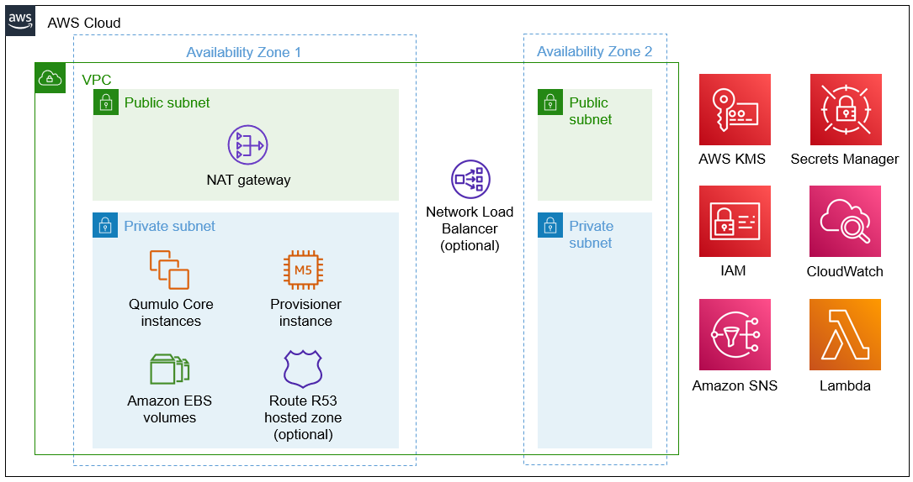

:xrefstyle: short

Deploying this Quick Start for a new virtual private cloud (VPC) with
default parameters builds the following {partner-product-short-name} environment in the
AWS Cloud.

[#architecture1]
.Quick Start architecture for {partner-product-short-name} on AWS

As shown in <<architecture1>>, the Quick Start sets up the following:

* Two Availability Zones: one for the Qumulo cluster and another that you could use for a https://qumulo.com/solution/recover-q/[disaster recovery Qumulo cluster^].*
* A VPC configured with public and private subnets, according to AWS best practices, to provide you with your own virtual network on AWS.*

* In the public subnet, a managed network address translation (NAT) gateway to allow outbound internet access for resources in the private subnet.

* In the private subnet:
** A cluster of Amazon Elastic Compute Cloud (Amazon EC2) instances that run the Qumulo Core software. (Qumulo refers to instances as nodes.)
** Amazon Elastic Block Store (Amazon EBS) volumes, which store the files for the Qumulo cluster.
** A provisioner EC2 instance (node), which automatically stops running after provisioning the Qumulo cluster. It automatically restarts during stack updates.
** (Optional) An Amazon Route 53 hosted zone to configure DNS A records for the cluster.

* AWS Key Management Service (AWS KMS) to use a customer managed key for encryption of EBS volumes.
* AWS Secrets Manager to store credentials.
* AWS Identity and Access Management (IAM) to manage roles.
* Amazon CloudWatch to log metrics for the Qumulo cluster and access a CloudWatch dashboard for the cluster.
* Amazon Simple Notification Service (Amazon SNS) to send alerts for EBS volume anomalies and EC2-instance recovery events.
* AWS Systems Manager for monitoring and storing the Qumulo cluster's provisioning state.
* Amazon S3 for populating content on the Qumulo cluster.
* AWS Lambda to collect metrics for the Qumulo cluster and monitor EBS volume health. (Qumulo refers to Lambda as Sidecar.)

[.small]#* The template that deploys the Quick Start into an existing VPC skips the components marked by an asterisk and prompts you for your existing VPC configuration.#
