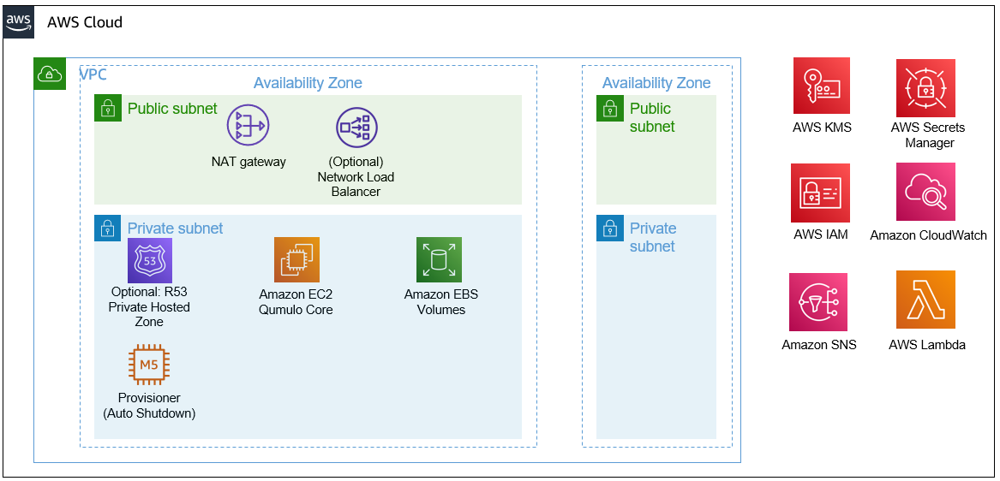

:xrefstyle: short

Deploying this Quick Start for a new virtual private cloud (VPC) with
default parameters builds the following {partner-product-short-name} environment in the
AWS Cloud.

// Replace this example diagram with your own. Follow our wiki guidelines: https://w.amazon.com/bin/view/AWS_Quick_Starts/Process_for_PSAs/#HPrepareyourarchitecturediagram. Upload your source PowerPoint file to the GitHub {deployment name}/docs/images/ directory in this repo. 

[#architecture1]
.Quick Start architecture for {partner-product-short-name} on AWS

As shown in <<architecture1>>, the Quick Start sets up the following:

* A VPC configured with public and private subnets, according to AWS best practices, to provide you with your own virtual network on AWS.*
* In the public subnet:
** A managed network address translation (NAT) gateway to allow outbound internet access for resources in the private subnet.*
// ** A Linux bastion host in an Auto Scaling group to allow inbound Secure Shell (SSH) access to EC2 instances in public and private subnets.*
* In the private subnet:
** A cluster of Qumulo EC2 instances
*** 4 to 20 nodes
*** 1TB to 6PB of usable capacity
** Multiple AWS Elastic Block Store (EBS) volumes connected to the Qumulo cluster
*** 28 unique EBS Volume configurations (ie Disk Configs) are available
*** All flash (SSD) and Hybrid (SSD+HDD) Disk Configs are available
** The Qumulo Sidecar which consists of two Lambda functions
*** One Lambda function sends Qumulo cluster metrics to Cloudwatch
*** The other Lambda function monitors the health of EBS volumes and automatically replaces any unhealthy volumes
** (Optional) AWS Route 53 private hosted zone
*** If R53 is resolving all DNS for the VPC then a R53 private hosted zone may be optionally provisioned to configure DNS A-records for the cluster.
** (Optional) Public IP Management
*** If desired a Network Load Balancer with an Elastic IP (public static) may also be configured
*** Note, this NLB listens on port 443 and has some inherent DoS capabilities.
*** As a best practice the cluster should be managed long-term via a secure host in the public or private subnet.
*** This functionality is only intended for initial configuration inspection and validation in the event no other EC2 machines exist in the VPC to manage the cluster
** Provisioner
*** An EC2 instance configures multiple parameters on the Qumulo cluster and within the AWS infrastructure
*** This instance automatically shuts down after successful provisioning
*** It is also restarted during stack updates to provision modifications to the infrastructure
// Add bullet points for any additional components that are included in the deployment. Make sure that the additional components are also represented in the architecture diagram. End each bullet with a period.
//* <describe any additional components>.

[.small]#* The template that deploys the Quick Start into an existing VPC skips the components marked by asterisks and prompts you for your existing VPC configuration.#
