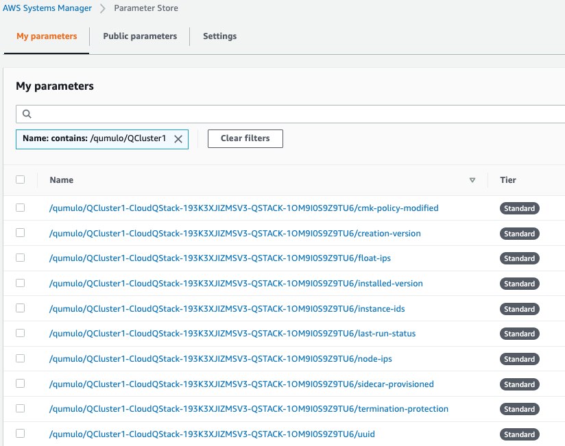
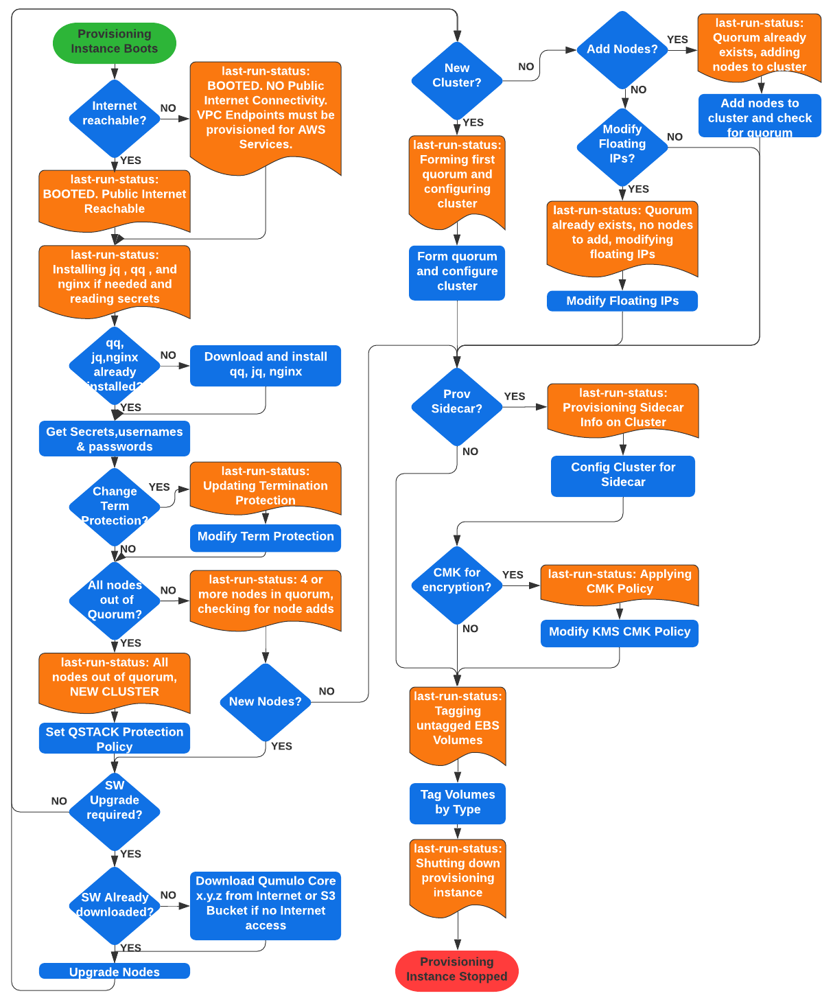

// Add any tips or answers to anticipated questions.

== FAQ

*Q.* I encountered a *CREATE_FAILED* error when I launched the Quick Start.

*A.* If AWS CloudFormation fails to create the stack, relaunch the template with *Rollback on failure* set to *Disabled*. This setting is under *Advanced* in the AWS CloudFormation console on the *Configure stack options* page. With this setting, the stack’s state is retained, and the instance keeps running so that you can troubleshoot the issue. (For Windows, look at the log files in `%ProgramFiles%\Amazon\EC2ConfigService` and `C:\cfn\log`.)
// Customize this answer if needed. For example, if you’re deploying on Linux instances, either provide the location for log files on Linux or omit the final sentence. If the Quick Start has no EC2 instances, revise accordingly (something like "and the assets keep running").

WARNING: When you set *Rollback on failure* to *Disabled*, you continue to incur AWS charges for this stack. Delete the stack when you finish troubleshooting.

For more information, see https://docs.aws.amazon.com/AWSCloudFormation/latest/UserGuide/troubleshooting.html[Troubleshooting AWS CloudFormation^].

'''

*Q.* I encountered a size-limitation error when I deployed the AWS CloudFormation templates.

*A.* Launch the Quick Start templates from the links in this guide or from another S3 bucket. If you deploy the templates from a local copy on your computer or from a location other than an S3 bucket, you might encounter template-size limitations. For more information, see http://docs.aws.amazon.com/AWSCloudFormation/latest/UserGuide/cloudformation-limits.html[AWS CloudFormation quotas^].

== Troubleshooting

=== Find the UUID for the cluster

//TODO Dave, Please revise this heading (and all headings under Troubleshooting) as problem statements.

The provisioning instance grabs a copy of the universally unique identifier (UUID) for the cluster after the first quorum is formed. Knowing the UUID may be necessary for troubleshooting future stack updates. Go to *Parameter Store* and filter on the top-level stack name. The following parameters are stored by the provisioning instance. The UUID is last on the list. Select it to view the UUID.

[#additional35]
.Parameters

=== Retrieve the cluster admin password

//TODO Dave, Please revise this heading (and all headings under Troubleshooting) as problem statements.

If you have forgotten the password, retrieve it from AWS Secrets Manager as follows:

. Open https://console.aws.amazon.com/secretsmanager[Secrets Manager^] in the AWS Console.
. Choose *Secrets*, and filter on the top-level stack name. 
. Look for *ClusterSecrets* and then choose *Retrieve secret value*.

If the administrator password is changed after the Quick Start is deployed, update it in Secrets Manager so that stack updates will work correctly.

//TODO Dave, The previous sentence doesn't belong in this section. Where does it go? What problem does it solve? And what are the steps?

=== The stack failed on the nested stack AWSVPCSTACK or CloudQStack

If the S3 bucket, key name prefix, or object URL are incorrect when deploying from your own S3 bucket, delete the stack and relaunch the template with the correct S3 parameters. Do NOT use the S3 URL. Use the object URL for
the template. Otherwise, the stack fails. If deploying from the AWS Quick Start bucket, do not change the bucket's name, prefix, or Region.

//TODO Dave, How do we know if the S3 bucket, key name prefix, or object URL are incorrect?

=== The stack failed when provisioning the QSTACK

These are the four most common causes:

* An AWS Marketplace offer has not been accepted that matches the *Qumulo AWS Marketplace Offering Accepted* parameter entered in the template.
* The EBS volumes configuration doesn't match the requirements for the *Qumulo AMI ID* entered when using the specified-AMI-ID option.
* The cluster failed to place in the placement group.
* Service quotas were not planned, and the QSTACK failed. 

Take the following actions:

Review the AMI ID and marketplace subscriptions. Check the EBS volume configuration selected in the template. If the cluster failed to place, choose a different Availability Zone to deploy the cluster in to find more available resources by selecting a different private subnet ID within the VPC. Adjust Service Quotas if necessary. Delete the failed stack and relaunch the template after rectifying the problem.

//TODO Dave, Please write out the above actions as either steps or bullets, depending on whether they need to be done in sequence.

=== The stack update failed and rolled back

No harm is done. No Qumulo cluster parameters for the QSTACK, except the number of EC2 instances, can be changed. The number of instances can’t be decreased.

//TODO Dave, Please rephrase the above to avoid negative statements ("no" and "can't"). Clarify what has happened, any impact it might have, and any actions we might take.

=== The cluster didn’t form quorum

If the quorum has not been formed, the UI appears as shown in the following screenshot.

[#additional36]
.UI for a cluster that hasn't formed quorum
image::../images/image36.png[Additional36]

These are the four most common causes:

* The software version specified in the template doesn’t exist.
* The software version specified in the template is older than the AMI software version.
* The VPC doesn't have public internet access.
* The VPC doesn’t have public internet access and the upgrade image(s) were not placed in the `/upgrade`` folder in the S3 bucket. See *The Provisioning instance didn't shut down*.

//TODO Dave, Please make cross-links to section headings.

DO NOT form quorum manually because the provisioning instance will not
be able to complete secondary provisioning of the cluster and AWS infrastructure.

Take the following actions:

Check for typos by reviewing the parameters entered in the template in the CloudFormation
console. Confirm that the software version specified for the cluster is equal to or newer than the version the Marketplace offer lists. Rectify and restart the provisioning instance or delete the stack and redeploy.

//TODO Dave, Please write out the above actions as either steps or bullets, depending on whether they need to be done in sequence.

=== The provisioning instance didn't shut down

In most use cases the provisioning instance shuts down within five minutes of the stack completing deployment. If the provisioning instance hasn't shut down after 15 minutes, there's likely an issue. Each software upgrade takes ~4 minutes. The instances are upgraded in parallel, so instance count has a minimal impact on execution time. If you have an AMI ID with an older software version, it may have to do multiple upgrades to get the cluster on the desired version. See the *AWS Parameter Store last-run-status* section below.

//TODO Dave, please create a cross-ref here.

//TODO Dave, In the previous paragraph, separate the description from the actions.

==== Common causes

These are the four most common causes:

* The VPC doesn’t have access to the public Internet or DNS resolution is not functioning.  Without access to public infrastructure the Provisioning instance can’t talk to AWS services like Secrets Manager, KMS, Parameter Store, or download the desired version of Qumulo Core software.  Review the public and private subnets, their route tables, and the NAT Gateway.  Review the AWS Parameter Store *last-run-status* to verify public internet connectivity (see the section below on last-run-status). Also double check that there are no Network ACLs blocking traffic.
* The VPC doesn’t have access to the public Internet, but this was planned.  One or more VPC Endpoints may be missing.  The VPC Interface Endpoints Security Group is not correct.  The desired Qumulo Core software version has not been placed in the S3 Bucket /upgrade folder.  See the section *Deploying without Internet Access*.
* A Customer Managed Key was provisioned and the policy was unable to be modified for the CMK because the policy didn’t have valid SIDs before the template was launched.
* A stack update was executed to add nodes.  The stack update succeeded but the provisioning instance didn’t shutdown and the nodes were not added to the cluster.  Most likely the Cluster’s admin password was changed post deployment.  If this is the case go to *Secrets Manager*, filter on the top-level stack name, and look for *ClusterSecrets*.  *Retrieve secret value* and *Edit*.  Update the admin password and save the secret.  Then stop and restart the provisioning instance.

Take the following actions:

. Clean up the CMK.
. Correct the VPC infrastructure.
. Update the administrative password.
. Restart the provisioning instance. See the sections that follow on restarting the provisioning instance, monitoring its status in the Parameter Store, and downloading logs.

//TODO Dave, Please give cross-links to the specific sections.

//TODO Dave, Please expand on each step above. How do we "clean up the CMK"? How do we "correct the VPC infrastructure"?

//TODO Dave, I've numbered the above as steps, but do we do these things in sequence? If not, clarify when you'd do each thing.

==== Review the AWS Parameter Store last-run status

//TODO Dave, Please revise this heading (and all headings under Troubleshooting) as problem statements.

If the provisioning instance doesn't automatically shut down, review the AWS Systems Manager Parameter Store *last-run-status* parameter to see where it stopped. As shown in the following screenshot, the parameter history shows the major blocks in the code where the provisioning instance executes. In this example, `QCluster1` was built for the first time as noted by the *Forming first quorum and configuring cluster* update to the last-run-status parameter. Two software upgrades were also performed per the Qumulo quarterly cadence to reach the 4.2.0 software release.

[#additional37]
.Parameter Store history
image::../images/image37.png[Additional37]

==== Restart the provisioning instance

//TODO Dave, Please revise this heading (and all headings under Troubleshooting) as problem statements.

The provisioning instance is designed to restart with every stack update. Further, it may be manually stopped from the AWS Console, if it doesn’t automatically stop, and then you can restart it manually. This may be helpful, for example, if the software wasn't placed in the S3 bucket when deploying without internet access, or a CMK policy wasn't cleaned up prior to deployment, or intended internet connectivity wasn’t functioning as expected and has been rectified.

//TODO Dave, In the previous paragraph, separate the description from the actions, and give enough detail to complete the actions.

==== Download the provisioning-instance log

//TODO Dave, Please revise all Troubleshooting headings as problem statements.

If none of the preceding troubleshooting steps rectify your problem, you may find the
provisioning-instance log helpful. To retrieve the log follow these steps:

. Go to the AWS Console *EC2 Instances* page.
. *Check the box* beside the provisioning instance.
. Choose *Actions* in the upper-right corner.
. Choose *Monitor & troubleshoot*.
. Choose *Get system log*.
. Choose *Download* in the upper-right corner.

Feel free to review the log in the AWS Console or download it to collaborate with Qumulo
to resolve the problem. Often the log shows an obvious error that points you to the
resolution.

==== The provisioning-instance flowchart

//TODO Dave, Please revise this Troubleshooting heading as a problem statement. 

//TODO Dave, Clarify why this flowchart is in this section, how we get to the full flowchart, and what we do with this info.

The provisioning instance executes the code in user data every boot cycle. The abbreviated flowchart, a
logic diagram, below shows the major branches and AWS SSM Parameter Store values for
the last-run status throughout the execution of the code.

[#additional38]
.The provisioning-instance flowchart

