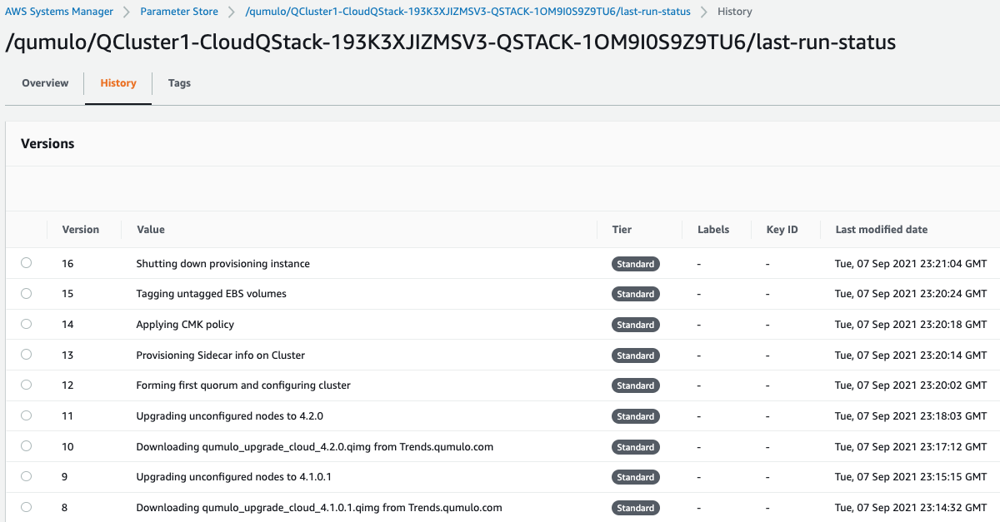

== FAQ

*Q.* I encountered a *CREATE_FAILED* error when I launched the Quick Start.

*A.* If AWS CloudFormation fails to create the stack, relaunch the template with *Rollback on failure* set to *Disabled*. This setting is under *Advanced* in the AWS CloudFormation console on the *Configure stack options* page. With this setting, the stack's state is retained, and the instance keeps running so that you can troubleshoot the issue. (For Windows, look at the log files in `%ProgramFiles%\Amazon\EC2ConfigService` and `C:\cfn\log`.)
// Customize this answer if needed. For example, if you're deploying on Linux instances, either provide the location for log files on Linux or omit the final sentence. If the Quick Start has no EC2 instances, revise accordingly (something like "and the assets keep running").

WARNING: When you set *Rollback on failure* to *Disabled*, you continue to incur AWS charges for this stack. Delete the stack when you finish troubleshooting.

For more information, see https://docs.aws.amazon.com/AWSCloudFormation/latest/UserGuide/troubleshooting.html[Troubleshooting AWS CloudFormation^].

'''

*Q.* I encountered a size-limitation error when I deployed the AWS CloudFormation templates.

*A.* Launch the Quick Start templates from the links in this guide or from another S3 bucket. If you deploy the templates from a local copy on your computer or from a location other than an S3 bucket, you might encounter template-size limitations. For more information, see http://docs.aws.amazon.com/AWSCloudFormation/latest/UserGuide/cloudformation-limits.html[AWS CloudFormation quotas^].

== Troubleshooting

=== I need to find the UUID for the cluster

You may need to know your cluster's universally unique identifier (UUID) for troubleshooting. The provisioner instance stores a copy of the UUID in Parameter Store, which is a capability of AWS Systems Manager. 

To find the UUID, follow these steps: 

. Open the https://console.aws.amazon.com/systems-manager/[Systems Manager console^].
. Choose *Parameter Store*.
. Look for */qumulo/<my stack>/<uuid>* (where the text in brackets represents your stack name). The value associated with the name is the UUID for the cluster.

=== I don't remember the cluster administrator password

To retrieve the cluster administrator password, follow these steps:

. Open the https://console.aws.amazon.com/secretsmanager[Secrets Manager console^].
. Choose *Secrets*.
. Choose the top-level stack name. 
. Under *ClusterSecrets*, choose *Retrieve secret value*.

=== The stack failed when provisioning the nested stack AWSVPCSTACK or CloudQStack

To determine and remedy the cause of the failure, follow these steps:

. Open the https://console.aws.amazon.com/cloudformation/[CloudFormation console^].
. Ensure that the *View nested* slider is set so that you can view nested stacks. 
. Choose the failed stack. 
. Under the *Events* tab, find the failure message. 
. Take appropriate action. For example, if message indicates that the S3 bucket, S3 key prefix, or object URL parameter values are incorrect (a common reason that these stacks fail), delete the stack and relaunch with the correct parameter values.

=== The stack failed when provisioning the nested stack QSTACK

To determine and remedy the cause of the failure, follow these steps:

. Open the https://console.aws.amazon.com/cloudformation/[CloudFormation console]. 
. Ensure that the *View nested* slider is set so that you can view nested stacks. 
. Select the failed stack. 
. Under the *Events* tab, find the failure message.
. Take appropriate action.
+
[cols="1,1"]
|===
|Common causes of QSTACK failing |Actions

// Space needed to maintain table headers
|An AWS Marketplace offer has not been accepted that matches the `QMarketPlaceType` parameter value you entered.| Open https://aws.amazon.com/marketplace[AWS Marketplace], search for the correct Qumulo Marketplace offering, and subscribe.
|The EBS volumes configuration doesn't match the requirements for the `QAmiID` parameter value you entered in the template.| Check the EBS volume configuration selected in the template, and relaunch the stack with EBS parameter values supported by the AMI.
|The cluster failed to place in the placement group.| Deploy the cluster into a different Availability Zone, or use a different private subnet ID within the VPC to find more available resources.
|The message "Service limit exceeded" indicates that the QSTACK failed because https://docs.aws.amazon.com/general/latest/gr/aws_service_limits.html[AWS service quotas^] (formerly referred to as limits) were not planned.| Either delete resources to free available capacity or contact AWS Support and request an increase in service quotas.
|===

=== The cluster didn't form quorum

You know that the cluster didn't form quorum if, when you open the Qumulo software, you're prompted to agree to the end user agreement instead of being prompted for your user name and password. 

[cols="1,1"]
|===
|Common causes of the cluster not forming quorum |Actions

// Space needed to maintain table headers
|The software version specified in the template doesn't exist or is older than the AMI software version.| Ensure that the software version specified for the cluster is equal to or newer than the version that the Marketplace offer lists.
|The VPC doesn't have public internet access.| Either add a NAT gateway to your existing VPC or, if you want to deploy without internet access, follow these instructions: https://github.com/qumulo/aws-quickstart-cloud-q/blob/main/supplemental-docs/deploying-without-inet.pdf[Cloud Q Quick Start: Deploying in a VPC with no internet access^].
|===

WARNING: Do not form quorum manually, or the provisioner instance won't be able to complete the secondary provisioning of the cluster and AWS infrastructure.

=== The provisioner instance is still running

The provisioner instance usually stops running within five minutes of the stack completing deployment. It can take longer if your AMI ID has an older software version. This is because each quarterly software upgrade takes about four minutes, and the upgrades happen one at a time until the instance reaches the desired version. (Cluster instances are upgraded in parallel, so instance count has a minimal impact on the time this takes.) If the provisioner instance hasn't stopped running after 15 minutes, there's probably an issue.

[cols="1,1"]
|===
|Common causes of the provisioner instance continuing to run |Actions

// Space needed to maintain table headers
|The VPC doesn't have access to the public internet. Without access to public infrastructure, the provisioner instance can't talk to AWS services (such as Secrets Manager, AWS KMS, and Systems Manager) and can't download the desired version of Qumulo Core software. | Review the public and private subnets, their route tables, and the NAT gateway. Make any needed corrections. Then reboot the provisioner instance as follows: Open the https://console.aws.amazon.com/ec2/v2/[EC2 console^]. Select the provisioner instance. Choose *Instance state*, *Reboot Instance*. (If deploying without internet access, see https://github.com/qumulo/aws-quickstart-cloud-q/blob/main/supplemental-docs/deploying-without-inet.pdf[Cloud Q Quick Start: Deploying in a VPC with no internet access^].)
|A customer managed key ID was entered in the `VolumesEncyrptionKey` parameter, and the key policy could not be modified because the key policy didn't have valid statement identifiers (SIDs) before the template was launched.| Go to AWS KMS and correct the key policy for the key you specified.  Then reboot the provisioner instance as follows: Open the https://console.aws.amazon.com/ec2/v2/[EC2 console^]. Select the provisioner instance. Choose *Instance state*, *Reboot Instance*. (To learn more on KMS key policies and cleanup see https://github.com/qumulo/aws-quickstart-cloud-q/blob/main/supplemental-docs/stack-deletion.pdf[Deleting the CloudFormation Stack^].)
|A stack update was executed to add cluster instances. The stack update succeeded, but the instances were not added to the cluster. The cluster's administrator password was probably changed after deployment. | Open the https://console.aws.amazon.com/secretsmanager[Secrets Manager console^], and choose the top-level stack name. Under *ClusterSecrets*, choose *Retrieve secret value*, *Edit*. Update the administrator password, and save the secret. Then reboot the provisioner instance as follows: Open the https://console.aws.amazon.com/ec2/v2/[EC2 console^]. Select the provisioner instance. Choose *Instance state*, *Reboot Instance*. 
|===

=== My problem is not described in this guide

If the earlier troubleshooting steps don't rectify your problem, review the AWS Parameter Store history. This history, as shown in <<additional37>>, often helps you discover where the provisioner instance is failing. To see this history, open the Parameter Store with the name */qumulo/<my stack>/last-run-status* (where the text in brackets represents your stack name).

[#additional37]
.Parameter Store history
[link=images/image37.png]

Finally, review the provisioning-instance log, which often shows an error that points you to the resolution. You can review the log in the console or download it to collaborate with https://qumulo.com/get-started/qumulo-care/[Qumulo Care^].

To retrieve the log follow these steps:

. Open the https://us-east-1.console.aws.amazon.com/ec2/v2/[EC2 console].
. Select the provisioner instance.
. Choose *Actions* on the upper right.
. Choose *Monitor & troubleshoot*, *Get system log*.
. (Optional) Download the log by choosing *Download* on the upper right.